# Software Studio 2023 Spring Assignment 2

### Scoring

|**Basic Component**|**Score**|**Check**|
|:-:|:-:|:-:|
|Membership Mechanism|10%|N|
|Complete Game Process|5%|N|
|Basic Rules|45%|N|
|Animations|10%|N|
|Sound Effects|10%|N|
|UI|10%|N|

|**Advanced Component**|**Score**|**Check**|
|:-:|:-:|:-:|
|Leaderboard|5%|N|
|Offline multi-player game|5%|N|
|Online multi-player game|15%|N|
|Others [name of functions]|1-15%|N|

---

## Basic Components Description : 
### 1. World map
#### The game has two stages
##### stage 1
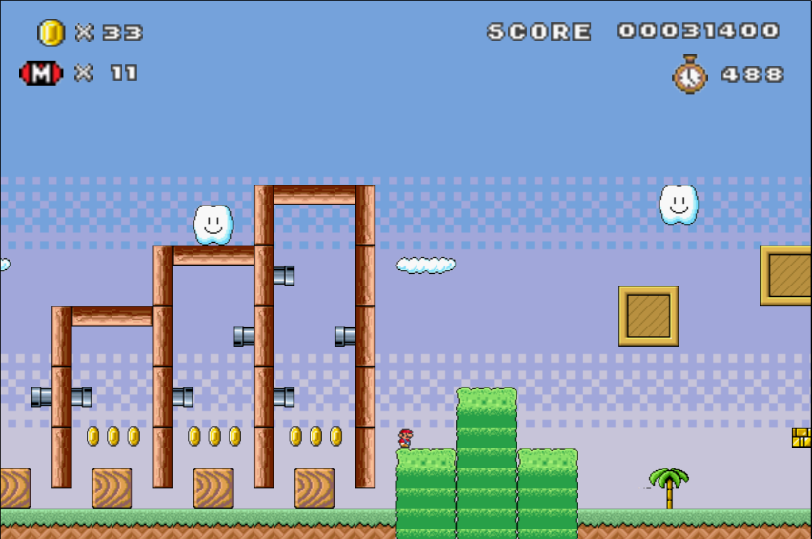
##### stage 2
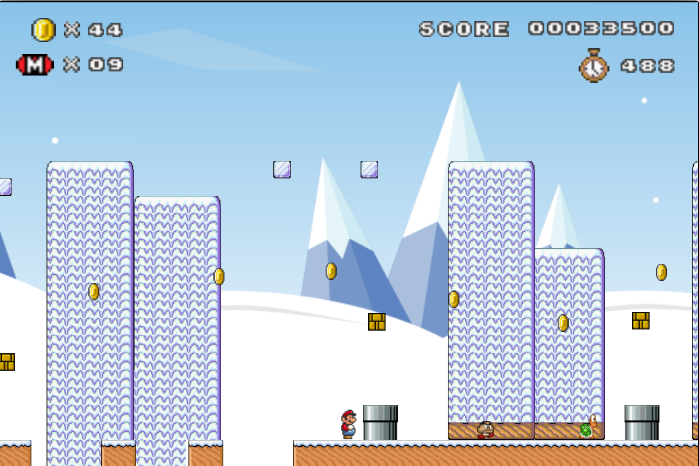
### 2. Player
#### Mario has multiple action
##### RUN
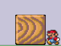
##### JUMP
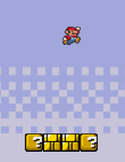
##### SQUAT
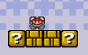
### 3. Enemies
#### This game has two types of enemy
##### Goomba
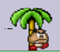
##### Turtle
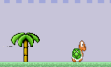
### 4. Question Blocks
#### Player can hit the block with its bottom ,and get the props inside it

### 5. Animations :
#### There are many objects have animations in the game, like : monster, bricks, question block...
### 6.Sound effects :
#### It include BGM and sound effect, for example : mario have jump sound effect if he jumps.
### 7. UI : 
#### The game has game UI

## Advanced Component Description : 
### 1.Big mario
#### If Mario eat the mushroom, it will become big

### 2.Conceal box
#### There are some conceal boxes in the map

### 3.Interesting pokemon?
#### There is a snorlax sit somewhere on the map.
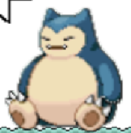
### 4.Difficult challenge
#### If you pass the stage2 through the weird way, you will finished the challenge, and get the special title.
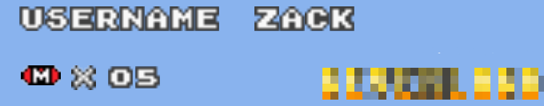
### 5.Turtle shell
#### The turtle can become shell if be stamped by Mario, and the Mario can kill other monster through shell.

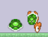

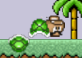
# Firebase page link

[Zack's Mario](zack-s-mario.web.app)